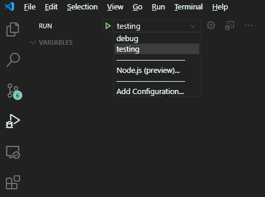
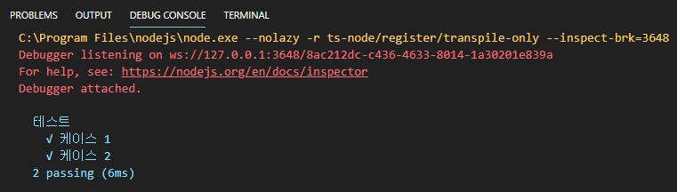
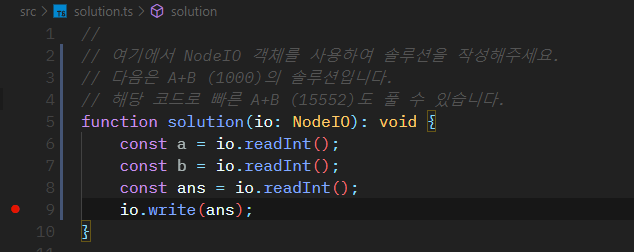
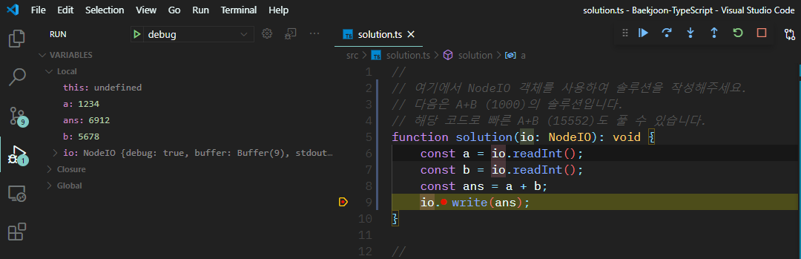

## 타입스크립트로 푸는 백준

백준 온라인 저지를 타입스크립트로 쉽게 풀 수 있도록 도와주는 템플릿입니다.

**지원 기능 :**

-   디버깅
-   다양한 입출력 테스팅
-   대용량 입출력을 위한 도구 지원

---

## 문제풀이 사이클

### 1. 문제풀기

`solution` 함수 안에서 `io` 객체를 사용하여 문제를 풀어주세요.

```ts
function solution(io: NodeIO) {
    const a = io.readInt();
    const b = io.readInt();
    io.write(a + b);
}
```

### 2. 테스팅 하기

`src/data`에 다양한 테스팅 파일을 작성하면, `VS Code`에서 `launch: test` 작업으로 테스팅할 수 있습니다.

```text
src/data/1
1 3

src/data/1-ans
4

src/data/2
-1 -3

src/data/2-ans
-4
```





### 3. 디버깅 하기

디버깅할 테스트 입출력을 `src/stdin`에 적고, 브레이크 포인트를 잡은 뒤에 `launch: debug` 작업을 실행하세요.

```text
src/stdin
1234 5678
```





### 4. 컴파일 후 제출하기

아쉽게도 백준에서는 타입스크립트를 지원하지 않으므로 `javascript`로 변환한 뒤에 제출해야 합니다. 터미널에서 `tsc`를 실행시켜 만들어진 `out/solution.js`를 제출하세요. (`launch: debug`를 실행해도 생성됩니다.)

---

## 유틸리티 목록

퍼모먼스 또는 생산성을 위한 간단한 스니펫을 제공합니다.

### makeArray

```ts
//
// Create Array of Number
const array = makeArray<number[]>(Array, 5);
[0, 1, 2, 3, 4];

//
// Create Array of Number, Via Mapping function.
const array = makeArray<number[]>(Array, 3, (i) => i * 2);
[0, 2, 4];

//
// Create Array of Object, Via Mapping function.
interface Point {
    x: number;
    y: number;
}
const array = makeArray<Point[]>(Array, 2, (i) => {
    const p: Point = {
        x: i,
        y: i,
    };
    return p;
});
[
    { x: 0, y: 0 },
    { x: 1, y: 1 },
];
```

**퍼포먼스 :**

`Array` 대신 `Int32Array`와 같은 저수준 배열을 사용하면 성능에 도움이 됩니다.

```ts
const array = makeArray(Int32Array, 5);
// [0, 1, 2, 3, 4]
```

### collaspe

오라클에서의 그것과 같습니다. 주어진 인자에서 처음으로 `null, undefined`가 아닌 값을 반환합니다.

```ts
collapse(undefined, null, 777, 123); // 777
```

전부 `undefined` 또는 `null`인 경우 에러가 발생합니다.

### FixedArrayAdaptor

`Array<T>`, `Int32Array`와 같은 배열 생성자를 인자로 받아, 그것을 사용하여 `Deque` 자료구조를 생성합니다. 내부적으로는 `크기가 고정된 환형 배열`로 구현되어 있습니다.

```ts
//
// 크기가 5인 Int32Array를 사용하여 데크를 생성.
const deque = new FixedArrayAdaptor(Int32Array, 5);

//
// 자료 삽입
deque.push(3); // [3];
deque.push(4); // [3, 4];
deque.unshift(2); // [2, 3, 4];

//
// 이터레이터 사용가능.
for (const n of deque) {
    io.write(n);
}
```
